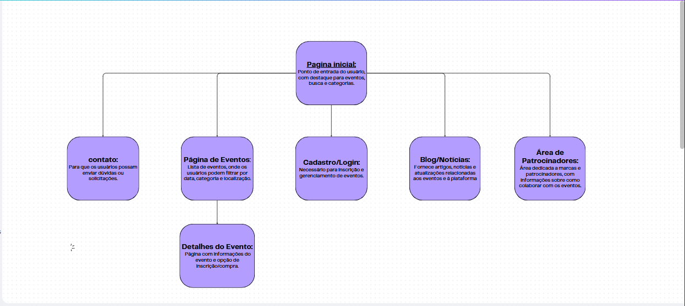
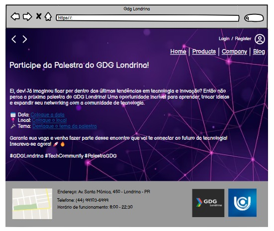

1.Objetivo do Site e Publico alvo:
Objetivo:

O site tem como objetivo divulgar eventos de forma eficiente, permitindo que usuários encontrem informações detalhadas, façam inscrições e comprem ingressos de maneira prática. Além disso, o site oferecerá suporte para organizadores gerenciarem seus eventos e para patrocinadores promoverem suas marcas.

Publico-alvo:
* organizadores de eventos
* Participantes interessados em se inscrever ou comprar ingressos
* Empresas e Patrocinadores 

2.Mapa do Site 

3.Prototipo de Baixa Fidelilade

4.Tecnologias a Serem Utilizadas

usaremos linguagem como:
 * HTML - fornece a estrutura básica de qualquer página da web
 * CSS - responsável pela aparência e pelo design do site
 * JavaScript - permitinto interatividade ao site

